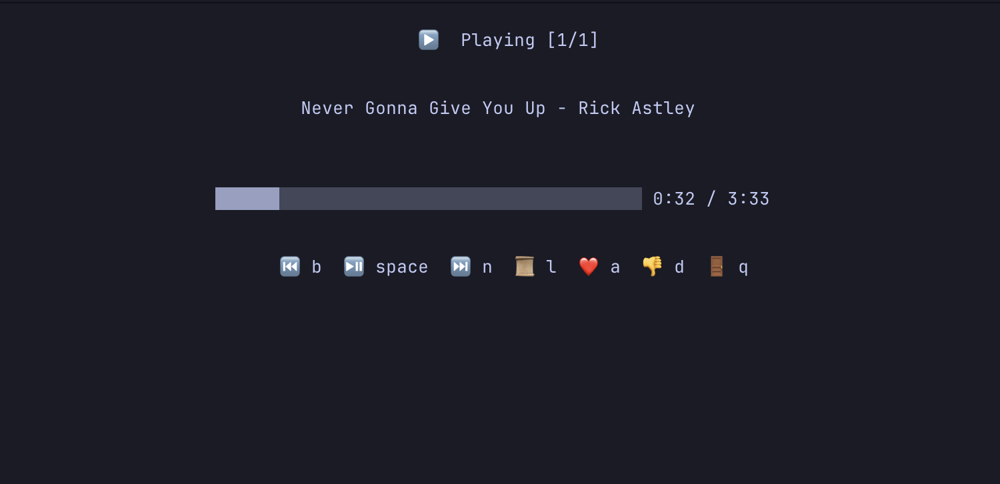
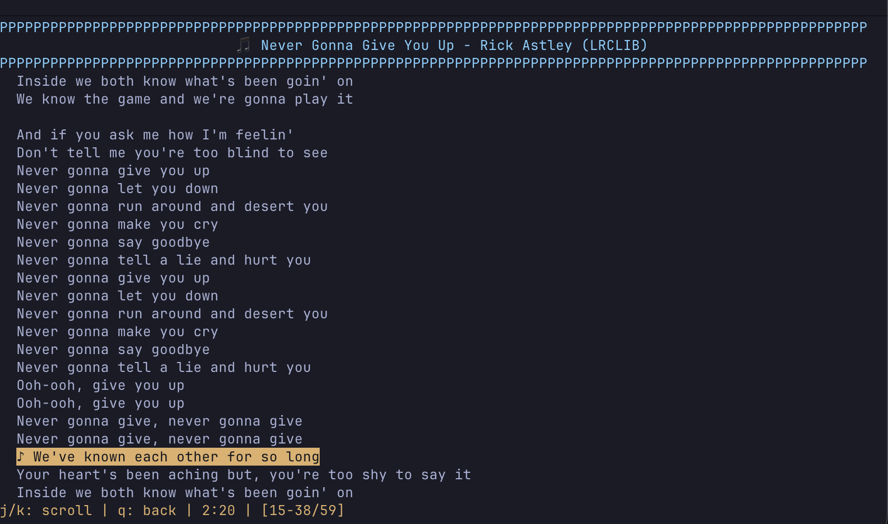

# YTM - YouTube Music CLI

🎵 **A simple, interactive command-line tool for YouTube Music**

> Testing Azure Pipelines with Claude code review integration

Stream music directly from YouTube Music in your terminal with intuitive controls, playlist management, and smart filtering.





## ✨ Features

- **🔍 Smart Search**: Search and play any song from YouTube Music
- **🎮 Interactive Controls**: Play/pause, skip, go back with simple key presses
- **📱 Vim-like Navigation**: Use `j/k` keys or arrow keys to navigate
- **📋 Local Playlists**: Create and manage personal playlists
- **👎 Smart Filtering**: Dislike songs to filter them from future results
- **📜 Lyrics Display**: View lyrics while listening (press `l`)
- **🎯 Radio Mode**: Automatic playlist generation based on your selection
- **🤖 AI-Powered**: Natural language music requests and AI-generated playlists

## 🚀 Quick Start

### Requirements

- Python 3.7+
- [mpv media player](https://mpv.io/installation/) (must be installed system-wide)

### Installation

1. **Clone the repository**

   ```bash
   git clone https://github.com/thieuluan1618/ytm.git
   cd ytm
   ```

2. **Set up virtual environment**

   ```bash
   python -m venv venv
   source venv/bin/activate  # On Windows: venv\Scripts\activate
   ```

3. **Install dependencies**

   ```bash
   pip install -r requirements.txt
   ```

4. **Quick alias setup (Optional but recommended)**

   For easier access with just `ytm` command:

   **Linux/macOS:**

   ```bash
   ./setup_alias.sh
   source ~/.zshrc  # or ~/.bashrc for bash
   ```

   **Windows PowerShell:**

   ```powershell
   .\setup_alias.ps1
   . $PROFILE
   ```

   **Windows Command Prompt:**

   ```cmd
   setup_alias.bat
   ```

   After setup, use `ytm` from anywhere instead of `python -m ytm_cli`

### Basic Usage

**Interactive search:**

```bash
ytm
# Enter search query when prompted
```

**Direct search:**

```bash
ytm "your favorite song"
```

**Non-interactive mode (automation/scripting):**

```bash
ytm search "song name" --select 1           # Auto-select first result
ytm search "song" -s 1 -v                   # With verbose output
ytm search "song" -s 1 -v --log-file debug.log  # Save debug logs
```

> **Note:** If you haven't set up the alias, use `python -m ytm_cli` instead of `ytm`

## 🎮 Controls

### During Song Selection

- `↑/↓` or `j/k` - Navigate through results
- `Enter` - Select and play song
- `q` - Quit

### During Playback

- `Space` - Play/pause
- `n` - Next song
- `b` - Previous song
- `l` - Show lyrics
- `a` - Add to playlist
- `d` - Dislike song (skip and filter from future results)
- `q` - Quit

## 📋 Playlist Management

**Create and manage playlists:**

```bash
ytm playlist list              # List all playlists
ytm playlist create            # Create new playlist
ytm playlist show "My Songs"   # View playlist contents
ytm playlist play "My Songs"   # Play entire playlist
ytm playlist delete "My Songs" # Delete playlist
```

**Add songs to playlists:**

- Press `a` during song selection or playback
- Choose existing playlist or create new one
- Song added without interrupting playback

## 🤖 AI Music Assistant

Use natural language to search and create playlists powered by AI (supports Google Gemini, OpenAI, Anthropic):

```bash
ytm llm ask "play something chill for studying"       # AI picks and auto-plays
ytm llm ask "upbeat pop songs for a workout"           # Natural language search
ytm llm playlist "lo-fi beats for rainy days" --play   # AI-generated playlist
ytm llm playlist "90s rock classics" -n 20             # 20-song playlist
```

Configure your provider in `config.ini`:

```ini
[llm]
provider = google       # google, openai, or anthropic
model = gemini-2.5-pro
```

## 🛠️ Configuration

The app uses `config.ini` for customization:

```ini
[general]
songs_to_display = 10
show_thumbnails = true

[mpv]
# Add custom mpv flags
flags = --no-video

[playlists]
directory = playlists
```

## 🎯 Philosophy

**Keep it simple for the listener to enjoy music.** Features are designed to be:

- **Intuitive**: Single-key shortcuts during playback
- **Non-disruptive**: Actions don't interrupt your listening experience
- **Consistent**: Same navigation patterns across all screens
- **Quick**: Important features accessible with simple key presses

## 🐛 Troubleshooting

Having issues? Check out the [**Troubleshooting Guide**](TROUBLESHOOTING.md) for solutions to common problems:

- 🔧 [Songs Skipping Continuously](TROUBLESHOOTING.md#songs-skipping-continuously)
- 📦 [MPV Not Found](TROUBLESHOOTING.md#mpv-not-found)
- 💻 [Terminal/Curses Errors](TROUBLESHOOTING.md#terminalcurses-errors)
- 📝 [Using Verbose Logging](TROUBLESHOOTING.md#using-verbose-logging)

**Quick diagnosis:**

```bash
# Enable verbose logging to see what's happening
ytm search "test" -s 1 -v --log-file debug.log

# Check versions
mpv --version
yt-dlp --version
```

## 📄 License

This project is open source. Please check the license file for details.

---

**Enjoy your music! 🎵**
# Test PR trigger
