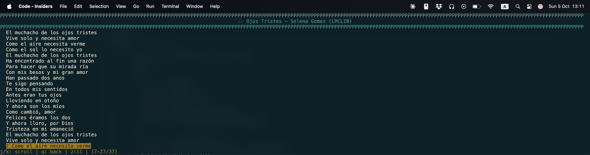

# YTM - YouTube Music CLI

🎵 **A simple, interactive command-line tool for YouTube Music**

Stream music directly from YouTube Music in your terminal with intuitive controls, playlist management, and smart filtering.



## ✨ Features

- **🔍 Smart Search**: Search and play any song from YouTube Music
- **🎮 Interactive Controls**: Play/pause, skip, go back with simple key presses
- **📱 Vim-like Navigation**: Use `j/k` keys or arrow keys to navigate
- **📋 Local Playlists**: Create and manage personal playlists
- **👎 Smart Filtering**: Dislike songs to filter them from future results
- **🔐 Optional Authentication**: Enhanced features with OAuth or browser auth
- **📜 Lyrics Display**: View lyrics while listening (press `l`)
- **🎯 Radio Mode**: Automatic playlist generation based on your selection

## 🚀 Quick Start

### Requirements
- Python 3.7+
- [mpv media player](https://mpv.io/installation/) (must be installed system-wide)

### Installation

1. **Clone the repository**
   ```bash
   git clone https://github.com/yourusername/ytm.git
   cd ytm
   ```

2. **Set up virtual environment**
   ```bash
   python -m venv venv
   source venv/bin/activate  # On Windows: venv\Scripts\activate
   ```

3. **Install dependencies**
   ```bash
   pip install -r requirements.txt
   ```

### Basic Usage

**Interactive search:**
```bash
python -m ytm_cli
# Enter search query when prompted
```

**Direct search:**
```bash
python -m ytm_cli "your favorite song"
```

**Non-interactive mode (automation/scripting):**
```bash
python -m ytm_cli search "song name" --select 1           # Auto-select first result
python -m ytm_cli search "song" -s 1 -v                   # With verbose output
python -m ytm_cli search "song" -s 1 -v --log-file debug.log  # Save debug logs
```

## 🎮 Controls

### During Song Selection
- `↑/↓` or `j/k` - Navigate through results
- `Enter` - Select and play song
- `q` - Quit

### During Playback
- `Space` - Play/pause
- `n` - Next song
- `b` - Previous song
- `l` - Show lyrics
- `a` - Add to playlist
- `d` - Dislike song (skip and filter from future results)
- `q` - Quit

## 📋 Playlist Management

**Create and manage playlists:**
```bash
python -m ytm_cli playlist list              # List all playlists
python -m ytm_cli playlist create            # Create new playlist
python -m ytm_cli playlist show "My Songs"   # View playlist contents
python -m ytm_cli playlist play "My Songs"   # Play entire playlist
python -m ytm_cli playlist delete "My Songs" # Delete playlist
```

**Add songs to playlists:**
- Press `a` during song selection or playback
- Choose existing playlist or create new one
- Song added without interrupting playback

## 🔐 Authentication (Optional)

Enhanced features with YouTube Music account access:

**OAuth setup (recommended):**
```bash
python -m ytm_cli auth setup-oauth    # Interactive OAuth setup
python -m ytm_cli auth status          # Check authentication status
```

**Browser authentication:**
```bash
python -m ytm_cli auth setup-browser  # Alternative method
```

**Troubleshooting:**
```bash
python -m ytm_cli auth troubleshoot    # Detailed help for auth issues
```

## 🛠️ Configuration

The app uses `config.ini` for customization:

```ini
[general]
songs_to_display = 10
show_thumbnails = true

[mpv]
# Add custom mpv flags
flags = --no-video

[playlists]
directory = playlists
```

## 🎯 Philosophy

**Keep it simple for the listener to enjoy music.** Features are designed to be:
- **Intuitive**: Single-key shortcuts during playback
- **Non-disruptive**: Actions don't interrupt your listening experience
- **Consistent**: Same navigation patterns across all screens
- **Quick**: Important features accessible with simple key presses

## 🐛 Troubleshooting

Having issues? Check out the [**Troubleshooting Guide**](TROUBLESHOOTING.md) for solutions to common problems:

- 🔧 [Songs Skipping Continuously](TROUBLESHOOTING.md#songs-skipping-continuously)
- 📦 [MPV Not Found](TROUBLESHOOTING.md#mpv-not-found)
- 🔐 [Authentication Issues](TROUBLESHOOTING.md#authentication-issues)
- 💻 [Terminal/Curses Errors](TROUBLESHOOTING.md#terminalcurses-errors)
- 📝 [Using Verbose Logging](TROUBLESHOOTING.md#using-verbose-logging)

**Quick diagnosis:**
```bash
# Enable verbose logging to see what's happening
python -m ytm_cli search "test" -s 1 -v --log-file debug.log

# Check versions
mpv --version
yt-dlp --version
```

## 📄 License

This project is open source. Please check the license file for details.

---

**Enjoy your music! 🎵**
