# Project Overview: YTM CLI Phase 2

## Project Structure

```mermaid
graph TD
    P1[Phase 1: Complete ✅<br/>Basic CLI Music Player]
    P2[Phase 2: AI Integration 🚧<br/>Smart Music Companion]
    
    P1 --> P2
    
    subgraph "Phase 1 Features"
        F1[YouTube Music Search]
        F2[MPV Player Integration]
        F3[Local Playlists]
        F4[Dislike System]
        F5[Keyboard Controls]
    end
    
    subgraph "Phase 2 Features"
        AI1[AI Recommendations]
        AI2[Mood Detection]
        AI3[Smart Playlists]
        AI4[Voice Control]
        AI5[Analytics Dashboard]
        AI6[Natural Language Search]
        AI7[Context Awareness]
        AI8[Learning System]
    end
    
    P1 -.-> F1
    P1 -.-> F2  
    P1 -.-> F3
    P1 -.-> F4
    P1 -.-> F5
    
    P2 -.-> AI1
    P2 -.-> AI2
    P2 -.-> AI3
    P2 -.-> AI4
    P2 -.-> AI5
    P2 -.-> AI6
    P2 -.-> AI7
    P2 -.-> AI8
```

## Development Timeline

## Technology Stack

### Current (Phase 1)
- **Language**: Python 3.8+
- **Music API**: ytmusicapi
- **Player**: MPV (subprocess + IPC)
- **UI**: curses + rich
- **Storage**: JSON files
- **Config**: ConfigParser (INI)

### Additions (Phase 2)
- **AI Models**: Claude, OpenAI, Gemini APIs
- **Database**: SQLite + SQLAlchemy
- **ML**: Local models (scikit-learn, transformers)
- **APIs**: Weather, Calendar integration
- **Voice**: Speech recognition libraries
- **Analytics**: Pandas for data processing

## Key Principles

1. **Simplicity First**: AI enhances, never complicates
2. **Privacy Focused**: Local-first data processing
3. **Performance**: Background AI, smooth playback
4. **Extensible**: Modular AI model integration
5. **Backwards Compatible**: Phase 1 functionality preserved

## Success Metrics

- **User Engagement**: 50% increase in daily usage
- **Recommendation Quality**: 80%+ user satisfaction
- **Performance**: No impact on music playback
- **Adoption**: 70%+ users enable AI features